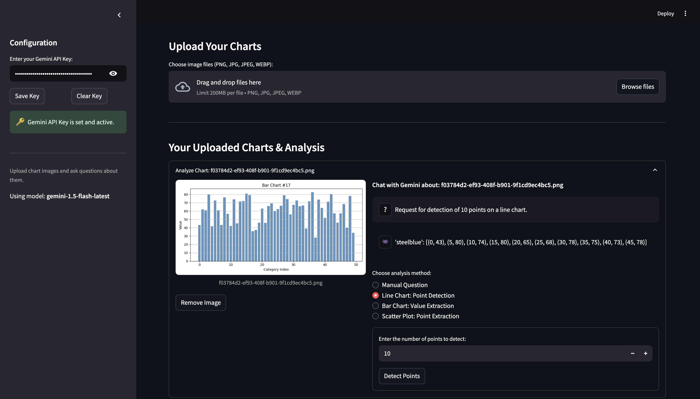

# GraphChat

GraphChat is a tool for data extraction from graphs using large language models (LLMs).

During development, we tested the accuracy of the models by calculating Mean Absolute Error (MAE) and Relative Error, and compared these results to human performance.

We also experimented with locally trained Gemma 3 models, though their results did not match the accuracy of the Gemini models.

For full details, please see the `report.pdf` file.

## UI Design




## Usage

```bash
pip install -r requirements.txt
```

```bash 
streamlit run main.py
```

## App Features

The app performs only the following four tasks:
- **Manual Question** – Ask any question about a chart image
- **Line Chart: Point Detection**
- **Bar Chart: Value Extraction**
- **Scatter Plot: Point Extraction**
